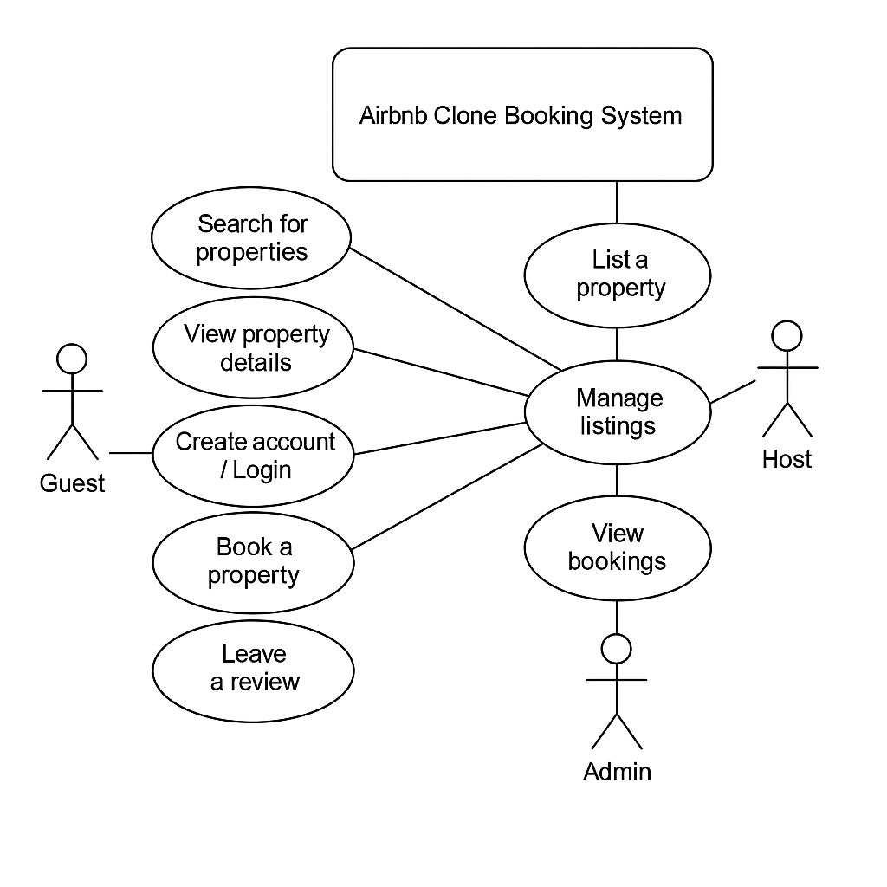

# Requirement Analysis in Software Development

## 📘 Introduction

Welcome to the **Requirement Analysis** repository. This project is part of our study of the Software Development Life Cycle (SDLC), focusing on the critical phase of **Requirement Analysis**. It aims to provide structured documentation, examples, and tools that highlight how to identify, document, and validate software requirements — using a booking management system as a case study.

---

## 🧠 What is Requirement Analysis?

**Requirement Analysis** is the process of identifying, analyzing, documenting, and validating the needs and expectations of stakeholders for a software system. It serves as the foundation for all future design and development activities.

In the SDLC, requirement analysis ensures:
- The system fulfills user needs
- The scope is clearly defined
- The project team understands what to build before starting development

It bridges the gap between clients (who know what they want) and developers (who know how to build it).

---

## ❓ Why is Requirement Analysis Important?

1. **Prevents Misunderstandings**
   - Clarifies expectations before development begins to avoid rework and miscommunication.

2. **Saves Time and Resources**
   - Well-defined requirements reduce scope creep, delays, and wasted effort.

3. **Improves Software Quality**
   - Leads to a more robust system aligned with user needs, increasing customer satisfaction and reducing bugs.

---

## 🔍 Key Activities in Requirement Analysis

- **Requirement Gathering**
  - Collecting high-level needs from stakeholders through interviews, surveys, and meetings.

- **Requirement Elicitation**
  - Extracting hidden needs, assumptions, and constraints through active engagement.

- **Requirement Documentation**
  - Structuring gathered information into clear, concise formats like user stories, BRDs, or specifications.

- **Requirement Analysis and Modeling**
  - Breaking down complex needs, identifying relationships, and using diagrams or models to visualize requirements.

- **Requirement Validation**
  - Ensuring the documented requirements are correct, complete, feasible, and aligned with business goals.

---

## 🧾 Types of Requirements

### 🔧 Functional Requirements

Functional requirements define **what the system should do**.

**Examples (Booking Management System):**
- Users can search for available properties.
- Users can book a property for specific dates.
- Admins can add or remove listings.
- System sends a confirmation email after booking.

### 🧱 Non-functional Requirements

Non-functional requirements define **how the system performs**.

**Examples:**
- The website should load within 2 seconds.
- The system should be available 99.9% of the time.
- Data should be encrypted at rest and in transit.
- The application should be accessible on both desktop and mobile devices.

---

## 🧩 Use Case Diagrams

Use case diagrams are visual tools used in Requirement Analysis to represent system functionality from a user’s perspective.

**Benefits:**
- Help identify actors and interactions
- Clarify system scope and user roles
- Simplify complex processes for stakeholders

---

## ✅ Acceptance Criteria

Acceptance Criteria define specific conditions a feature must meet to be accepted by stakeholders.

**Importance:**
- Set a clear “Definition of Done”
- Avoid ambiguity in features
- Align expectations between devs and stakeholders

**Example (Checkout Feature):**
- The user must be logged in to access the checkout page.
- The system should display selected property details (price, dates).
- The user can securely enter payment information and confirm the booking.
- A success message and confirmation email are sent after booking.

---

## 📄 License

This repository is open source and available under the [MIT License](LICENSE).
